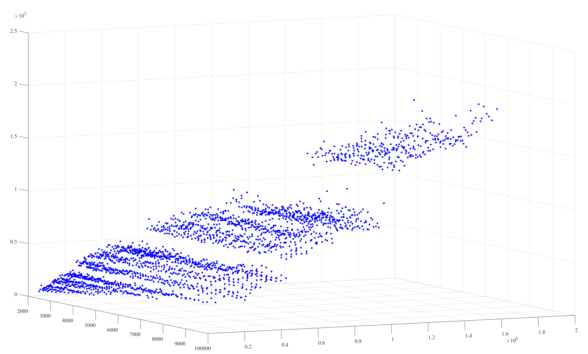
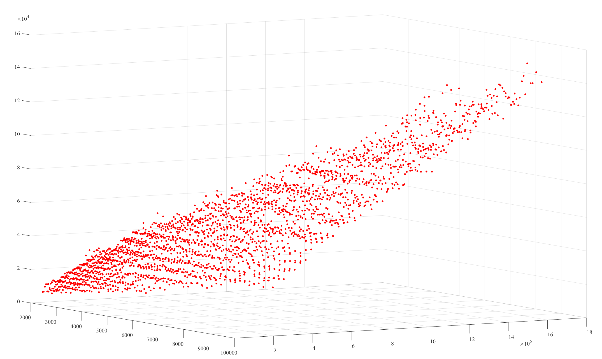
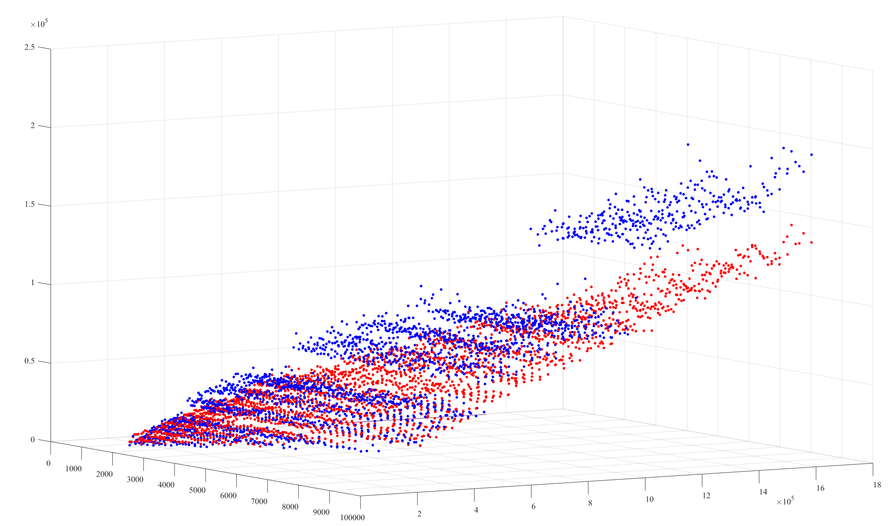
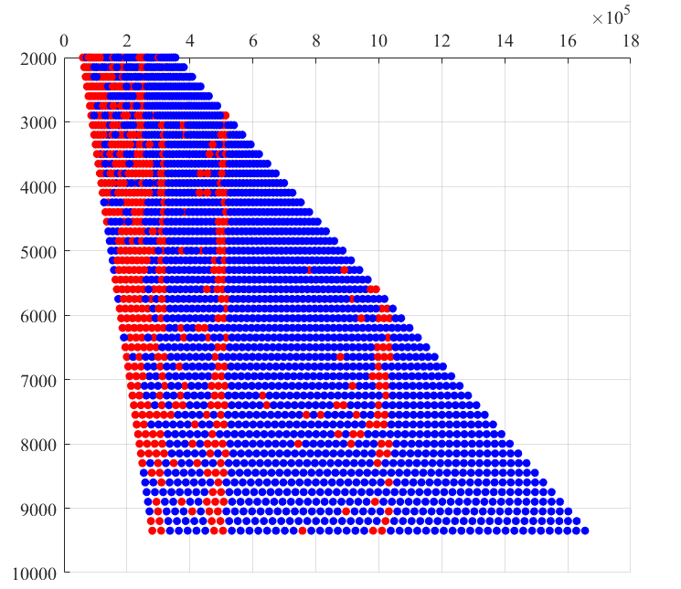

## 不同输入长度下的乘法策略

横纵坐标值均为乘数的 ``limb`` 数量

### 极不平衡乘法 

对于极不平衡的乘法，我们有另一种高效的算法： ``3ntt-crt``乘法。我们采用三个大小接近 $2^{63}$ 的模数，在 $R = 2^{64}$ 的蒙哥马利域内分别使用 ``ntt`` 算法计算两个乘数的卷积在蒙哥马利域内的结果，通过 CRT 方法将其转化到整数域中。这种方法需要乘数的长度为二的幂，故而并不适合处理长度平衡的乘法。但对于长度不平衡的乘法，这种方法可以有效地减少计算量。原因在于：

1. 对于短序列，我们只需要计算一次卷积，即可知道其转化到数论域的结果。后续计算相当于只需要一次``ntt``加一次``intt``。而不是两次``ntt``加一次``intt``。相当于省去了三分之一的计算量。
2. 对于长序列，我们可以将其分割为多个短序列，并对每个短序列进行 ``3ntt-crt`` 乘法。这样可以有效地减少计算量。

对于第二条，分块的块数将会决定计算所需要的空间和时间复杂度。
我们可以假定，两个乘数的长度分别为 ``m`` 和 ``n``。同时可以认为：$m = l\cdot n$
我们假定将``m``等分为``k``段，每段长度为``m/k``。则有：
总时间复杂度为：
$$
\begin{aligned}
O(k\cdot(\dfrac{m}{k}+n)\cdot \log(\dfrac{m}{k}+n))&=
O((m + k \cdot n)\cdot \log(\dfrac{m}{k}))\\&=    
O(m\cdot \log(\dfrac{m}{k}) - n\cdot k\log(\dfrac{m}{k}))\\    
\end{aligned}
$$

我们希望该函数：
$$
f(k) = m\cdot\log(\dfrac{m}{k}) - n\cdot k\log(\dfrac{m}{k})
$$
能取至最小值。
当 $m$ 与 $n$ 相差的倍数不大时，我们可以用 $\sqrt{\dfrac{m}{n}}$ 来很好的估计最佳的 $k$。但当 $m$ 和 $n$ 相差的倍数较大时，此估计将会带来比较大的误差，故我们采用牛顿法求解最佳的 $k$，可以知道：$k \sim \dfrac{m}{n\log(n)}$，以此作为初始点进行牛顿迭代即可知道最佳的 $k$。

以下的四张图片是不平衡乘法在``FFT-SSA``和``3ntt-crt``算法下的计算时间对比。计算时间单位为微秒，x轴y轴坐标为乘数的``limb``数量。

``3ntt-crt``乘法更加连续，计算时间更少，``FFT-SSA``算法采用直接固定分段数乘的策略。空间复杂度也较高。

我们采用当两数倍数相差较小时，采用``FFT-SSA``算法，当两数倍数相差较大时，采用``3ntt-crt``算法。此倍数为宏常量``MUL_NTT_MULTIPLE_THRESHOLD``我们设置为 90，即当两数长度差距超过 90 时，采用``3ntt-crt``算法，否则采用``FFT-SSA``算法。

